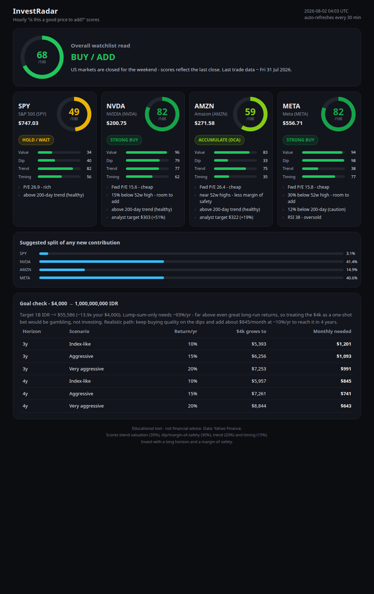

# InvestRadar

**Hourly, Buffett-minded "is this a good price to add?" scores** for a small
watchlist — the S&P 500 plus a few mega-cap compounders — with an honest check on
whether your savings goal is realistic.

Built for the question: _"Check hourly if now is a good price to invest in
S&P 500 / NVIDIA / Amazon / Meta, and tell me if my goal is on track."_



> ⚠️ **Educational tool, not financial advice.** Scores are a disciplined nudge for
> dollar-cost-averaging into quality — not a trading signal or a promise of returns.

---

## What it does

Every time you run it, InvestRadar:

1. Pulls **real-time-ish** data from Yahoo Finance for `SPY`, `NVDA`, `AMZN`, `META`
   (latest price, ~1 year of daily closes, P/E, dividend yield, analyst target) plus
   the live **USD/IDR** exchange rate.
2. Scores each name **0–100** on a Buffett-leaning blend:

   | Component | Weight | Idea |
   |---|---:|---|
   | **Valuation** | 35% | What you pay decides your return — cheaper quality scores higher. |
   | **Dip / margin of safety** | 30% | "Be greedy when others are fearful" — buying below recent highs beats chasing. |
   | **Trend / quality** | 20% | A business above its 200-day line is compounding; a broken trend is a caution. |
   | **Timing** | 15% | RSI keeps you from buying something wildly overbought. |

3. Gives an **overall verdict**, a suggested **split for any new contribution**, and a
   per-asset "why".
4. Runs an **honest goal check**: converts your 1,000,000,000 IDR target to USD at the
   live rate and shows the monthly contribution needed at realistic returns (spoiler:
   turning $4,000 into ~$55k in 3–4 years on returns alone would need ~90–140%/yr — so
   the honest path is steady contributions into quality on the dips).

Outputs written on every run:

- `reports/latest.md` — the full Markdown report
- `reports/dashboard.html` + `index.html` — a self-contained, mobile-friendly dashboard
- `reports/history/<timestamp>.md` — a dated snapshot
- `reports/history/scores_log.csv` — one row per run, so you can chart scores over time

## Requirements

Python 3.12+ and a single third-party package, **`requests`** (already in this repo's
environment). Everything else is the Python standard library — no pandas/numpy/yfinance.

```bash
pip install -r invest_radar/requirements.txt   # just 'requests'
```

## Usage

From the repository root:

```bash
python -m invest_radar                 # print scores + write reports
python -m invest_radar --serve         # also serve the dashboard at localhost:8000
python -m invest_radar --cash 4000     # override starting cash used in the goal maths
python -m invest_radar --no-write      # print only, don't touch files
```

### How to open the dashboard

- **Easiest:** double-click `invest_radar/index.html` — it works fully offline and
  auto-refreshes every 30 minutes.
- **Or serve it:** `python -m invest_radar --serve` then open
  <http://localhost:8000/index.html>.

### Run it every hour (cron)

```bash
# crontab -e   (runs at the top of every hour)
0 * * * * cd /path/to/agents && /usr/bin/python3 -m invest_radar >> /tmp/invest_radar.log 2>&1
```

A helper script, `invest_radar/run_hourly.sh`, does the same and can optionally commit
the refreshed reports.

## How scoring works (details)

- **Valuation** maps a P/E (forward for the growth names, trailing for the index) onto a
  score via per-asset anchor curves in `config.py` — deliberately conservative, so even a
  great business only earns a top score when it's genuinely well priced.
- **Dip** rewards pullbacks from the 52-week high and price sitting below the 50-day line,
  with a cap so it doesn't blindly reward a falling knife.
- **Trend** rewards a healthy position above the 200-day line and a 50>200 ("golden cross")
  configuration; a badly broken trend is treated as a yellow flag, not a bargain.
- **Timing** uses 14-day RSI (oversold → higher, overbought → lower).

If fundamentals fail to load in a given run, the valuation weight is redistributed across
the other three components so the tool still produces a score.

## Project layout

```
invest_radar/
├── config.py        # watchlist, valuation anchors, weights, goal, verdict bands
├── datasource.py    # Yahoo Finance client (chart + crumb fundamentals + FX)
├── indicators.py    # pure-Python SMA / RSI / drawdown / momentum
├── scoring.py       # the 0–100 blend + portfolio allocation
├── goal.py          # honest CAGR / monthly-contribution maths
├── report.py        # console + Markdown rendering
├── dashboard.py     # self-contained HTML dashboard
├── cli.py           # orchestration + file output + local server
├── run_hourly.sh    # cron helper
└── tests/           # offline unit tests (no network)
```

## Tests

```bash
python -m unittest discover -s invest_radar/tests -v
```

## Customizing

Edit `invest_radar/config.py` to change the watchlist, valuation bands, scoring weights,
or the goal (starting cash, target, horizons, return scenarios).
