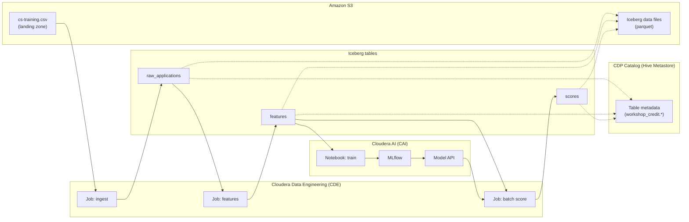

# Credit Scoring Workshop — Architecture (1-page)

**Use case:** Credit default prediction on Cloudera Cloud  
**Services:** CDE (Spark jobs) + CAI (train & deploy) + Iceberg on S3  
**No Airflow · No CDE Sessions required · Jobs-only**

---

## End-to-end flow



---

## Iceberg tables in this workshop

| # | Table | Created by | Required? | Purpose |
|---|-------|------------|-----------|---------|
| — | `workshop_credit.connectivity_test` | `credit-00-validate` | **Optional** | Smoke test only |
| 1 | `workshop_credit.raw_applications` | `credit-01-ingest-raw` | **Yes** | Raw credit applications from CSV |
| 2 | `workshop_credit.features` | `credit-02-build-features` | **Yes** | Model-ready features + label |
| 3 | `workshop_credit.scores` | `credit-04-batch-score` | **Yes** | Default probability + risk band |

**Answer for your team:** Yes — we create **3 production Iceberg tables** in the workshop (plus 1 optional test table).

---

## Job sequence (Jobs-only)

```
S3: cs-training.csv
        │
        ▼
┌───────────────────────┐
│ credit-01-ingest-raw  │  CDE Spark Job
└───────────┬───────────┘
            ▼
   Iceberg: raw_applications
            │
            ▼
┌───────────────────────┐
│ credit-02-build-features │  CDE Spark Job
└───────────┬───────────┘
            ▼
   Iceberg: features  ──────────►  CAI: train + MLflow + deploy API
            │                              │
            ▼                              │
┌───────────────────────┐                  │
│ credit-04-batch-score │  CDE Spark Job ◄──┘ (calls model API)
└───────────┬───────────┘
            ▼
   Iceberg: scores
```

---

## Why Iceberg without opening Hive / Impala / CDW?

| Layer | What you use | What runs behind the scenes |
|-------|----------------|-----------------------------|
| **Compute** | CDE Spark jobs | Kubernetes + Spark |
| **Table format** | Iceberg | Open table format on S3 |
| **Catalog** | Automatic (no manual step) | Hive Metastore (CDP SDX) |
| **Storage** | S3 | Parquet files + Iceberg metadata |
| **ML** | CAI notebook + API | Reads same `features` table |
| **SQL warehouse** | Not required for demo | CDW/Impala optional later |

**Key message:** Participants only use **CDE Jobs** and **CAI**. The platform catalog links everything; no separate warehouse setup in the workshop.

---

## What each table contains

### `raw_applications`
- Source: CSV from S3
- ~40,000 rows
- Renamed columns, `ingested_at` timestamp

### `features`
- Engineered fields: utilization, age, debt_ratio, delinq_total, income flags, etc.
- Label: `default_flag`
- Used by CAI for training

### `scores`
- `applicant_id`, `probability_default`, `risk_band` (A/B/C/D)
- `model_name`, `model_version`, `scored_at`
- Audit trail for demo

---

## Demo talking points (30 seconds)

1. **CDE** ingests from S3 and builds governed **Iceberg** tables — serverless Spark, no cluster ops.
2. **CAI** trains on the same `features` table — no data copy, MLflow tracks experiments.
3. **CDE** batch-scores via the **CAI model API** and writes results to `scores`.
4. One platform: **CDE + CAI + Iceberg + S3**, catalog managed by CDP.

---

## Prerequisites checklist

- [ ] CSV in S3 landing path
- [ ] CDE virtual cluster running (`workshopcluster`)
- [ ] CAI project available
- [ ] Database `workshop_credit` (created by first job if missing)
- [ ] Ranger: read/write on `workshop_credit.*`
